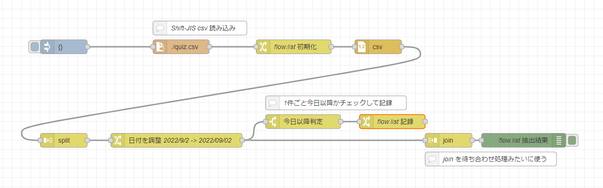
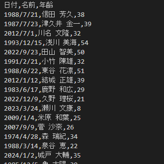

# node-red-ogiri-01-csv-flow



## 概要

ある CSV から列 A の日付が今日の日付以降のデータだけ抜きとる


## CSV データは quiz.csv



## フロー方針

- CSV データは quiz.csv を読み込みます
- ファイル読み込み
  - Shift-JIS データのことが良くあるので CSV データは Shift-JIS で読んでいます
  - CSV データは全件で読み込んで split ノードで各行の処理を行ってます
- データを記録する flow.list の空配列で初期化
- 各行の処理
  - 日付を調整 2022/9/2 -> 20220902
    - JSONata 利用
  - 1件ごと今日以降かチェックして該当してたら flow.list 記録
    - switch ノードで JSONata 判定
    - flow.list 記録 JSONata $append でデータ結合
- json ノードで split ノードで全ての処理が終わった待ち合わせ処理担当
- 最後に flow.list 結果を表示

## フロー JSON

[node-red_dir/flows.json](node-red_dir/flows.json)

## Gitpod で試す

以下ボタンをクリックすると Gitpod で試せます。

[](https://gitpod.io/#https://github.com/1ft-seabass/node-red-ogiri-01-csv-flow)

エディタが開いたら

```
npm run node-red
```

ターミナルでこちらのコマンドを実行。